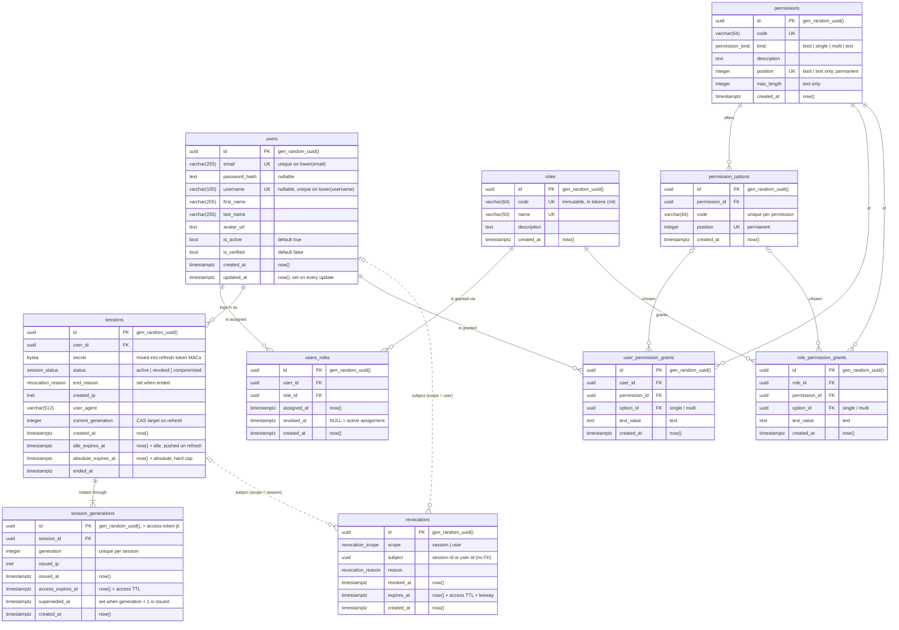

# auth-lib-postgres — reference PostgreSQL adapter

Implements every `auth-lib` repository port on top of `sqlx` / PostgreSQL.
The core `auth-lib` crate never depends on this crate. A host application
either uses this adapter or writes its own against the same traits.

| Port (auth-lib trait)    | Implementation              | Status      |
|--------------------------|-----------------------------|-------------|
| `UserRepository`         | `PgUserRepository`          | implemented |
| `RoleRepository`         | `PgRoleRepository`          | implemented |
| `UserRoleRepository`     | `PgUserRoleRepository`      | implemented |
| `SessionRepository`      | `PgSessionRepository`       | implemented |
| `RevocationRepository`   | `PgRevocationRepository`    | implemented |
| `PermissionRepository`   | `PgPermissionRepository`    | implemented |
| `KeyRepository`          | `PgKeyRepository`           | implemented |
| `NodeRepository`         | `PgNodeRepository`          | implemented |

---

## Wiring it into auth-lib

```rust
use std::sync::Arc;
use auth_lib::{AuthLib, config::{ConfigLoader, EnvLoader}};
use auth_lib_postgres::*;

let pool = build_pg_pool(&PgConfig::from_env()?).await?;
run_migrations(&pool).await?;   // apply any pending schema migrations
// `repositories(&pool)` supplies every required repository (users, roles,
// user_roles, sessions, revocations, keys); a missing one is a compile error.
let auth = AuthLib::builder(EnvLoader.load_config()?, repositories(&pool))
    .permissions(Arc::new(PgPermissionRepository::new(pool.clone()))) // AUTH_AUTHZ_MODE=permissions|combined
    .cluster(transport, Arc::new(PgNodeRepository::new(pool)))        // optional, see docs/cluster.md
    .build()?;

// Load revocations / keys / catalog and join the cluster; then tick every heartbeat.
auth.start().await?;
```

## Schema conventions

- **Keys.** Every table has a surrogate `id uuid` primary key, generated by the database (`gen_random_uuid()`).
- **`created_at` everywhere.** Every table records when the row was inserted. Event columns such as `assigned_at`, `issued_at` and `revoked_at` sit alongside it where they carry business meaning.
- **`updated_at` only on `users`.** It is the only table with free-form edits. Every other change already has its own column (`revoked_at`, `superseded_at`, `ended_at`, `idle_expires_at`), and `roles` and `revocations` never change.
- **The database is the clock.** Every persisted timestamp comes from `now()`. auth-lib passes durations such as TTLs, timeouts and retention, never instants, and reads back what was stored. The JWT `iat`/`exp` are copied from the generation row. Only stateless access-token verification uses the application clock, with a leeway.
- **UTC.** All timestamps are `timestamptz`, which is stored as a UTC instant. The pool also pins each connection's `TimeZone` to `UTC`.
- **ENUMs.** Closed value sets are Postgres ENUM types: `session_status`, `revocation_scope` and `revocation_reason`.

## Tables

| Table                 | Purpose |
|-----------------------|---------|
| `users`, `roles`, `users_roles` | Identity and RBAC. `roles.code` is the immutable identifier carried in tokens (`rol`) |
| `permissions`, `permission_options` | The application's permission catalog (`bool`, `single`, `multi`, `text`). Every `bool`/`text` permission and every option takes a permanent **position** from `permission_position_seq`; tokens encode grants by position (see [`docs/authorization.md`](../../docs/authorization.md)) |
| `user_permission_grants`, `role_permission_grants` | Granted values: one row per `bool`/`text` grant or per chosen option. Read only at login / refresh |
| `sessions`            | One row per login on one device: status (`active`, `revoked` or `compromised`), creating IP, user agent, current generation, idle and absolute expiry, and a per-session secret. **No tokens are stored.** |
| `session_generations` | Rotation history (newest N per session, default 10): issuing IP, `issued_at`, `superseded_at`. The row's `id` is the access token's `jti`. |
| `revocations`         | Persisted denylist (`session` or `user` scope), `pending` → `enforced` once a covered token is used. Rows only live for the access TTL plus leeway. |
| `cluster_nodes`       | Registry of auth-lib instances as a state machine: lifecycle `state` (`joining` → `active` → `leaving`) and `heartbeat` (`online` / `offline`; deleted when still silent). Written only on state changes; read once at startup ([`docs/cluster.md`](../../docs/cluster.md)) |
| `verifying_keys`      | Public Ed25519 keys published by instances; `revoked` keys are rejected everywhere |

Refresh rotation is a compare-and-swap on `sessions.current_generation`, done
inside a transaction. When refreshes race, one wins and the others get a
conflict, which the core resolves through the grace window.

### Entity-relationship diagram

This diagram shows the schema built by [`migrations/`](migrations/).
Solid lines are foreign keys, and every one of them is `ON DELETE CASCADE`.
The dotted lines from `revocations` are logical references only.
`subject` holds either a session id or a user id, depending on `scope`, so
there is no FK constraint. A revocation row can outlive the session or user
it refers to.



### Constraints and indexes

| Table                 | Constraint / index | Purpose |
|-----------------------|--------------------|---------|
| `users`               | `users_email`, `users_username_key` (unique on `lower(...)`) | One account per email and per username, case-insensitively |
| `roles`               | `roles_name_key`, `roles_code_key` (unique), `chk_roles_code_format` | Unique names; unique, well-formed codes |
| `permissions`         | `permissions_code_key`, `permissions_position_key` (unique) | One entry per code; positions never collide |
| `permissions`         | `chk_permissions_position`, `chk_permissions_max_length` | Position exactly for `bool`/`text`; `max_length` exactly for `text` |
| `permission_options`  | `permission_options_permission_code_key`, `permission_options_position_key` (unique) | Option codes unique per permission; positions never collide |
| `*_permission_grants` | `*_value_key` (partial: `option_id IS NULL`), `*_option_key` (partial: `option_id IS NOT NULL`) | One `bool`/`text` row per owner and permission; one row per chosen option |
| `users_roles`         | `unique_user_role_active` (unique, partial: `revoked_at IS NULL`) | A user holds a role at most once at a time, while old revoked assignments stay as an audit trail |
| `users_roles`         | `chk_users_roles_revoked_after_assigned` | `revoked_at` can't precede `assigned_at` |
| `users_roles`         | `idx_users_roles_active`, `idx_users_roles_removed` (partial) | Fast lookup of a user's active and revoked assignments |
| `users_roles`         | `idx_users_roles_user_id`, `idx_users_roles_role_id` | FK lookups |
| `sessions`            | `chk_sessions_ended` | Active ⇔ `ended_at` and `end_reason` are both NULL |
| `sessions`            | `chk_sessions_generation_positive` | `current_generation >= 1` |
| `sessions`            | `idx_sessions_user_active` (partial: `status = 'active'`) | Session cap and logout-all, oldest first |
| `sessions`            | `idx_sessions_purge` (expression: `LEAST(idle, absolute, COALESCE(ended_at, 'infinity'))`) | Purge is an index scan. The purge query must repeat the expression verbatim |
| `session_generations` | `session_generations_session_generation_key` (unique `(session_id, generation)`) | One row per rotation. Rows older than the newest N are trimmed on each refresh |
| `session_generations` | `chk_session_generations_positive` | `generation >= 1` |
| `revocations`         | `idx_revocations_expires_at` | `list_active()` and `purge_expired()` |
| `*_permission_grants` | `idx_user_permission_grants_user_id`, `idx_role_permission_grants_role_id` | `effective_grants` at login / refresh |

Allowed status, scope and reason values are enforced by the ENUM types, so no CHECKs are needed.

---

## Configuration

`PgConfig::from_env()` reads:

```env
DB_HOST=localhost
DB_PORT=5432          # optional, defaults to 5432
DB_USER=postgres
DB_PASSWORD=secret
DB_NAME=auth          # optional, defaults to "auth"
DB_MAX_POOL_SIZE=10   # optional
DB_CONNECT_TIMEOUT_SECS=5  # optional
```

---

## Migrations

The schema is a series of numbered SQL files in [`migrations/`](migrations/),
applied in order by sqlx's migrator. It is embedded in the crate as `MIGRATOR`
and run with `run_migrations(&pool)`. Postgres records each applied file, with
a checksum, in the `_sqlx_migrations` table, so a run only applies the files it
hasn't seen. Concurrent runs are serialised with an advisory lock.

Rules:

- **Never edit a migration that has been applied anywhere.** The checksum check will refuse to run.
- **To change the schema, add the next file**, e.g. `0002_add_login_attempts.sql`.
- **Current migrations:** `0001` initial schema · `0002` authorization · `0003` cluster sync · `0004` node state machine.
- **Adding an ENUM value** is `ALTER TYPE revocation_reason ADD VALUE '...'` in a new migration, plus the matching variant in `src/enums.rs`. Values can't be removed or reordered without recreating the type.

## setup_db — database setup script

```bash
cargo run -p auth-lib-postgres --bin setup_db            # create DB + apply pending migrations
cargo run -p auth-lib-postgres --bin setup_db -- --reset # dev only: drop everything first
```

What it does:

1. **Loads `.env`** from the current directory (skips silently if absent). Real environment variables take priority.
2. **Checks the PostgreSQL server.** If it is unreachable or the credentials are wrong, it prints a specific error and exits.
3. **Creates the database** if it doesn't exist yet.
4. **Replaces a legacy schema.** Tables created before versioned migrations (no `_sqlx_migrations`) are dropped, and so is everything when `--reset` is given. If any table contains data, it asks first:
   ```
   ⚠️  Existing tables with data were found in database 'auth'.
      Drop everything and re-create? [y/N]:
   ```
   Answering `N` exits with no changes made.
5. **Applies pending migrations** and lists each one. A database that is already up to date is left untouched.

---

## Integration tests

The tests in `tests/` need a reachable database. `helpers::pool()` applies
pending migrations itself, so it's enough to have run `setup_db` once:

```bash
cargo test -p auth-lib-postgres
```
